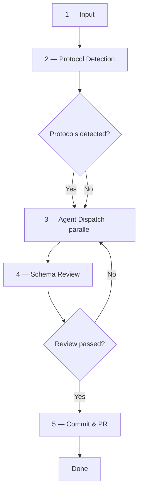
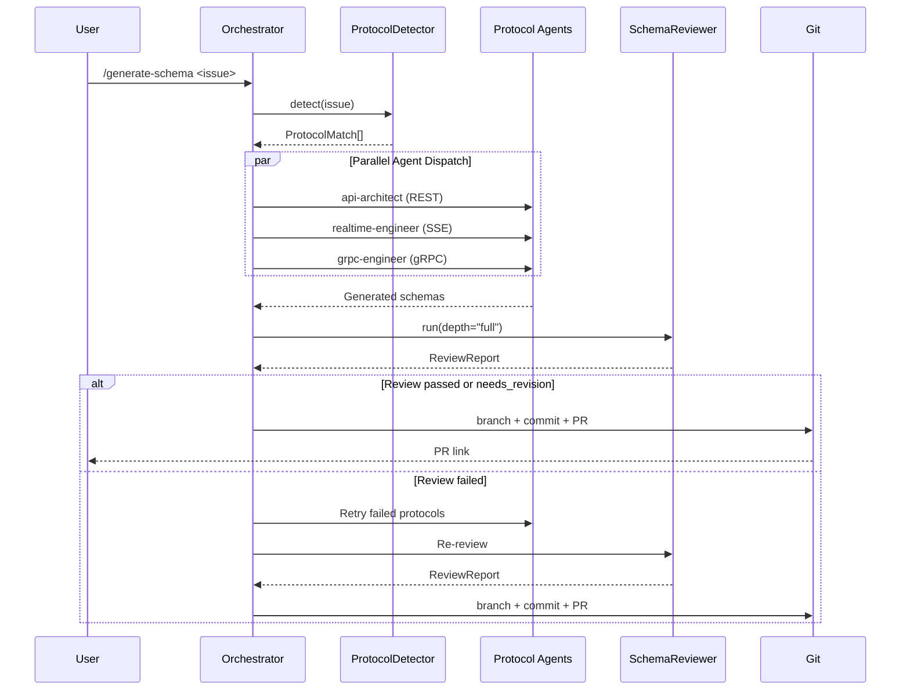

# Generate Schema Workflow

End-to-end pipeline that turns a Linear issue into validated, committed protocol schemas.

## Example Invocation

```
/generate-schema https://linear.app/team/issue/ABC-123
/generate-schema "Build a real-time chat system with REST endpoints for user management and WebSocket for messaging"
```

## Workflow Overview



---

## Phase 1 — Input

Accept one of the following as input:

| Format | Example |
|--------|---------|
| Linear issue URL | `https://linear.app/team/issue/ABC-123` |
| Issue description text | Free-form text describing the desired system |

If a URL is provided, fetch the issue title, description, and labels from the Linear API via the tracker module (`src/uptempo/tracker/`). If raw text is provided, construct an ad-hoc issue object for downstream processing.

---

## Phase 2 — Protocol Detection

Invoke the `ProtocolDetector` class defined in `src/uptempo/orchestrator/protocol_detector.py`.

**How it works:**

1. Concatenate the issue title and description into a single lowercase text blob.
2. Scan the text and issue labels against `PROTOCOL_RULES` — a list of 9 protocol definitions, each with a keyword set and confidence-boost labels.
3. Compute confidence for each matched protocol:
   - `confidence = min(0.4 + (matched_keywords / total_keywords) × 0.4, 0.8)`
   - If any issue label matches `confidence_boost_labels`, add `+0.15` (capped at `1.0`).
4. Sort results by confidence descending.
5. If nothing matches, default to `rest` / `api-architect` at confidence `0.3`.

The output is a list of `ProtocolMatch` objects (`protocol`, `agent`, `confidence`, `matched_keywords`).

---

## Phase 3 — Agent Dispatch

Route each detected protocol to the appropriate agent and skill. All agents whose protocol confidence is **≥ 0.3** are dispatched **in parallel**.

### Protocol → Agent → Skill Routing Table

| Protocol | Agent | Skill | Output Directory |
|----------|-------|-------|------------------|
| REST | `api-architect` | `generate-openapi` | `openapi/` |
| SSE | `realtime-engineer` | `generate-sse` | `sse/` |
| WebSocket | `realtime-engineer` | `generate-websocket` | `websocket/` |
| gRPC | `grpc-engineer` | `generate-grpc` | `proto/` |
| GraphQL | `graphql-architect` | `generate-graphql` | `graphql/` |
| Kafka / RabbitMQ / NATS | `event-engineer` | `generate-event-schema` | `events/` |
| Webhook | `integration-engineer` | `generate-webhook` | `webhook/` |
| MQTT | `integration-engineer` | `generate-mqtt` | `mqtt/` |
| tRPC | `trpc-engineer` | `generate-trpc` | `trpc/` |

Agent definitions live in `.github/agents/`. Skill definitions live in `.github/skills/`.

### Parallel Execution Strategy

- Launch one task per detected protocol. Tasks are independent — each agent writes to its own output directory.
- If `realtime-engineer` is invoked for both SSE and WebSocket, dispatch two parallel tasks with different skills.
- If `integration-engineer` is invoked for both Webhook and MQTT, dispatch two parallel tasks with different skills.
- Pass the full issue context (title, description, labels) to each agent so it can generate schemas grounded in the same requirements.

### Error Handling

- If an agent task fails, **retry once** with the same input.
- If the retry also fails, mark that protocol as `errored`, log the failure, and continue with remaining protocols.
- At least one protocol must succeed to proceed to Phase 4. If all fail, report the errors and stop.

---

## Phase 4 — Schema Review

After all agents complete, invoke the `schema-reviewer` agent (`.github/agents/schema-reviewer.md`) backed by the `SchemaReviewer` class in `src/uptempo/reviewer/checker.py`.

The reviewer performs a **full-depth** review (`depth="full"`) consisting of:

1. **Protocol Discovery** — Scan the workspace for generated schema directories (see `_PROTOCOL_DIRS` mapping in `checker.py`).
2. **Naming Convention Check** — Validate camelCase for JSON-based schemas (REST, SSE, GraphQL), snake_case for Protobuf (gRPC), PascalCase for TypeScript (tRPC).
3. **Cross-Protocol Mapping** — Ensure the same domain concept uses consistent naming and typing across all protocols where it appears.
4. **Security Coverage** — Verify auth schemes are applied consistently across every protocol.
5. **Error Code Mapping** — Validate HTTP ↔ gRPC ↔ GraphQL ↔ tRPC error-code consistency.
6. **Backward Compatibility** — Detect removed fields, changed types, or tightened validation that could break existing consumers.

The reviewer produces a `ReviewReport` (defined in `src/uptempo/reviewer/models.py`) containing:

- `review_status`: `passed` | `needs_revision` | `failed`
- `review_depth`: `full`
- `summary`: Human-readable summary
- `findings[]`: List of `Finding` objects with `verdict` (PASS/WARNING/FAIL), `severity`, `category`, `protocols`, `description`, `location`, and optional `fix`
- `protocol_coverage`: Boolean flags for each of the 9 protocols
- `skipped[]`: Protocols that were skipped with reasons

### Review Outcome

| Status | Action |
|--------|--------|
| `passed` | Proceed to Phase 5 |
| `needs_revision` | Log warnings, proceed to Phase 5 (warnings are informational) |
| `failed` | Re-dispatch agents for protocols with FAIL findings (one retry), then re-review. If still failing, stop and report. |

---

## Phase 5 — Commit & PR

1. **Branch**: Create a new branch named `schema/<issue-id>` (e.g., `schema/ABC-123`).
2. **Commit**: Stage all generated schema files and commit with message:
   ```
   feat(schema): generate schemas for <issue-id>

   Protocols: <comma-separated list>
   Confidence: <protocol:score pairs>
   Review: <passed|needs_revision>
   ```
3. **Pull Request**: Open a PR against the default branch with:
   - Title: `feat(schema): <issue title>`
   - Body: Include the review summary, protocol coverage table, and any warnings.
   - Labels: `schema`, `generated`, plus one label per protocol (e.g., `rest`, `grpc`).

---

## Full Pipeline Diagram


